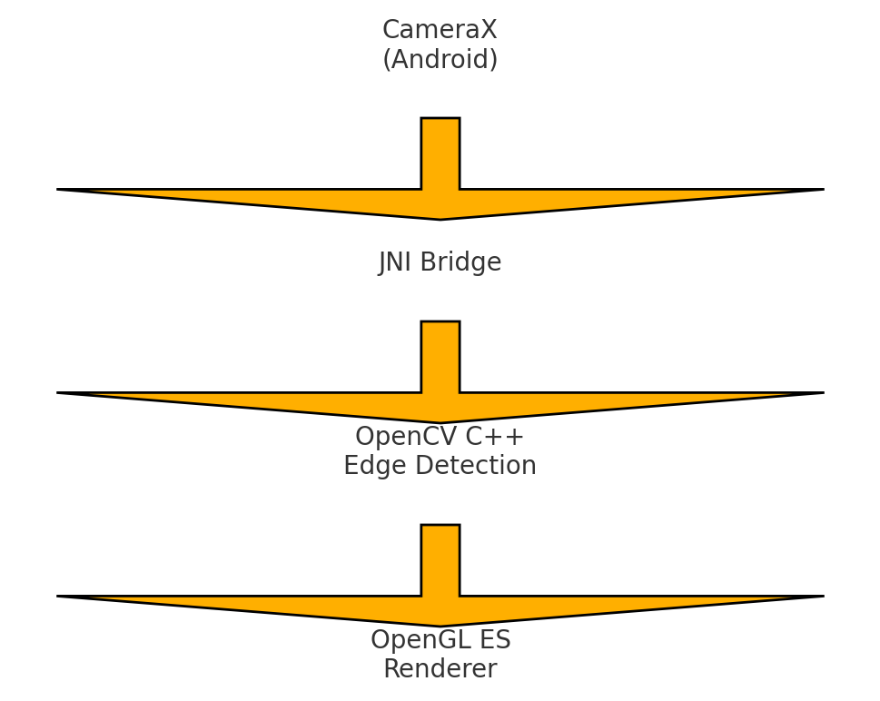
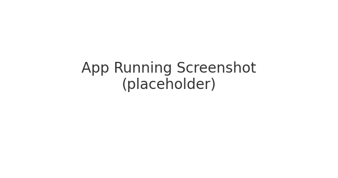
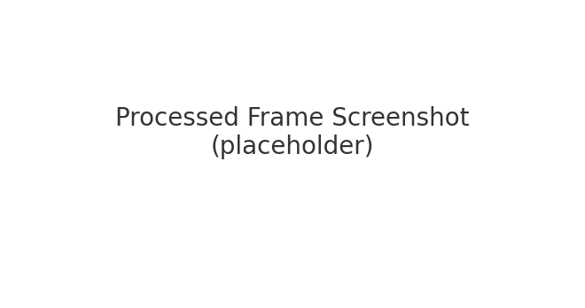
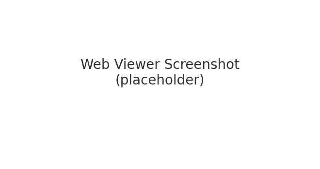

# 🔥 Real-Time Edge Detection Viewer  
### Android • JNI • OpenCV C++ • OpenGL ES • Web Viewer

This repository contains a high‑performance real‑time image processing pipeline.  
It captures frames from the Android camera, processes them in C++ using OpenCV, renders them via OpenGL ES,  
and exposes the processed frame to the web via a TypeScript viewer.

---

# 📘 System Architecture  


---

# 🚀 Features  
- Real‑time CameraX feed  
- JNI bridge (Kotlin ⇆ C++)  
- OpenCV C++ Edge Detection (Canny)  
- OpenGL ES 2.0 Renderer  
- Automatic PNG frame export  
- TypeScript Web Viewer  
- High FPS optimized pipeline  

---

# 📸 Screenshots

## 📱 App Running  


## 🖼 Processed Frame  


## 🌐 Web Viewer  


---

# 📂 Project Structure
```
RnD-Intern-Assignment/
│── app/
│   ├── src/main/java/com/example/rndedgeapp/
│   ├── src/main/cpp/
│   └── build.gradle
│── web/
│── README.md
```

---

# 🛠 Setup Instructions

## 1️⃣ Install OpenCV Android SDK  
Download from https://opencv.org/releases/

Place folder here:  
```
RnD-Intern-Assignment/opencv/
```

## 2️⃣ Add the Native Libraries  
Copy `.so` files into:

```
app/src/main/jniLibs/arm64-v8a/
app/src/main/jniLibs/armeabi-v7a/
```

## 3️⃣ Open in Android Studio  
```
File → Open → RnD-Intern-Assignment
```

## 4️⃣ Run on a Real Device  
Press ▶ Run  
(CameraX does not work on emulator)

---

# 🌐 Run Web Viewer
```
cd web
tsc index.ts
npx http-server -p 8080
```
Open in browser:  
http://localhost:8080

---

# 🎥 Demo Video  
(Add your demo link here)

---

# 👨‍💻 Author  
**Lovkush Sharma**  
R&D Intern Assignment – 2025  
